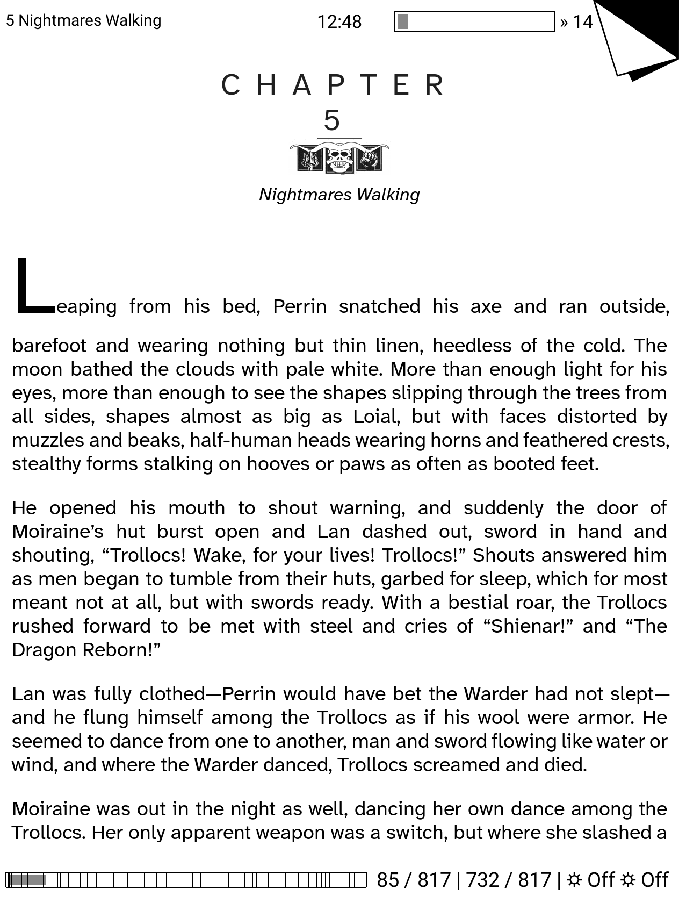

# 📚 Bookends and Dogends

A [KOReader](https://github.com/koreader/koreader) plugin that merges and extends the functionality of two existing bookmark manager plugins.

## 🙏 Based On

| Plugin | Author |
|--------|--------|
| [bookends.koplugin](https://github.com/AndyHazz/bookends.koplugin) | [@AndyHazz](https://github.com/AndyHazz) |
| [Koreader-Custom-Bookmark-Manager](https://github.com/sadke8465/Koreader-Custom-Bookmark-Manager) | [@sadke8465](https://github.com/sadke8465) |

## ✨ Features

- 🔀 **Merged plugin** — combines both bookmark managers into a single unified plugin
- 📊 **Progress Bars** — visual reading progress indicators
- 🌟 **Brightness & Warmth Tokens** — support for brightness and warmth display tokens

## 📸 Screenshots

## 📦 Installation

1. Download or clone this repository
2. Copy the plugin folder into your KOReader `plugins` directory
3. Restart KOReader

## 📄 License

Please refer to the original plugins for licensing information.
